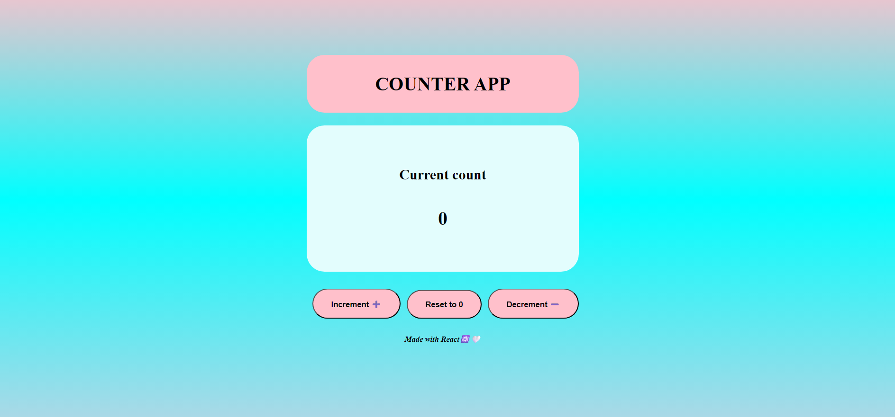

# React Counter App

A modern and responsive Counter App built using **React.js**. This project was created to practice React fundamentals such as state management and event handling.

## Features

-  Increment Counter
-  Decrement Counter
-  Reset Counter
-  Modern Gradient UI
-  Smooth Hover Animations
-  Responsive Layout

## Built With

- React.js
- JavaScript (ES6)
- CSS3
- HTML5

## Concepts Practiced

- useState Hook
- Event Handling
- JSX
- Component Structure
- CSS Flexbox
- CSS Transitions
- Conditional Rendering Basics

## Preview

## Future Improvements

- Dark Mode
- Keyboard Shortcuts
- Prevent Negative Count
- Count Animation
- Custom Step Counter (+5 / -5)

## Learning Outcome

This project helped me understand how React state works and how to build interactive user interfaces without following a tutorial.

## Live Demo

https://react-project-counter-app.vercel.app/

## GitHub Repository

https://github.com/Reshma0927/react-counter-app

## Author

Reshma Gandeti 

---

⭐ If you like this project, please do star the repository.
